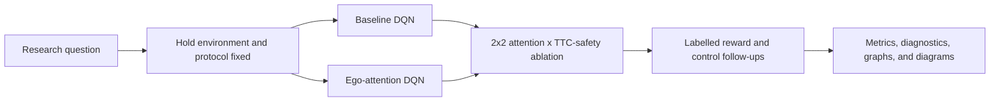

# Structured Highway RL: Decision Making

This repository is the standalone structured, lane-based track of the Highway
RL project. It studies discrete-lane decision making in native
`highway-v0` using a standard DQN, an ego-centered attention DQN, and explicit
reward and safety ablations.

The separate laneless/unstructured track is not part of this checkout. Every
environment, observation, action, learner, notebook, and diagnostic described
here uses the lane-based HighwayEnv contract.

## 1. Research question

The primary research question is:

> Does an ego-centered attention representation improve highway decision
> making relative to a standard DQN when the environment, reward, training
> budget, random seeds, and evaluation protocol are held fixed?

The main safety question is:

> Does adding an explicit time-to-collision (TTC) safety/anti-lag reward reduce
> collisions and improve safety metrics, and does its effect depend on the
> policy representation?

These questions are answered in stages:

1. Establish a standard structured DQN reference.
2. Repeat the same experiment with an ego-centered attention feature
   extractor.
3. Run the four-cell attention-by-TTC-safety factorial ablation.
4. Treat potential-field reward, adaptive longitudinal control, traffic-flow
   terms, driver aggressiveness, and lane-change safety as labelled follow-up
   studies rather than mixing them into the primary comparison.

## 2. Experimental contract

The controlled experiments use native `highway-v0` with:

- lane-based kinematic observations;
- five nearby entities represented by relative `presence`, `x`, `y`, `vx`,
  and `vy` features for the main DQN comparison;
- `DiscreteMetaAction` lane-level actions;
- deterministic evaluation seeds recorded in each run summary; and
- reward, traffic, safety, and controller switches recorded with the model
  configuration.

The standard structured baseline uses three lanes, 20 vehicles, a 40-step
episode duration, IDM traffic, and a 20,000-timestep training budget. The
congested studies use their own explicitly documented traffic profile. A
metric is only comparable across runs when the full environment and evaluation
configuration matches.

The reported metrics are:

- mean episode reward;
- collision rate, where a collision is an episode ending with `crashed=True`;
- average speed in metres per second;
- overtakes, counted when a vehicle first ahead of the ego moves behind it;
- average same-lane TTC; and
- minimum same-lane TTC.

## 3. Research flow



The full research-flow description is in
[`docs/research_flow.md`](docs/research_flow.md). The complete catalog of the
13 retained PNG figures, the research-flow diagram, and their source
notebooks is in [`docs/visualizations.md`](docs/visualizations.md). The
versioned figures are grouped under [`artifacts/dqn/`](artifacts/dqn/).

## 4. Results and current interpretation

The values below are archived source-workspace snapshots preserved during the
repository split. They are provenance records, not newly trained checkpoints.
The current checkout intentionally does not contain raw models or TensorBoard
event files.

| Study | Status | Evaluation | Mean reward | Collision rate | Mean speed | Mean TTC | Minimum TTC |
| --- | --- | ---: | ---: | ---: | ---: | ---: | ---: |
| Baseline DQN driver-spectrum run | Recorded | 1,000 episodes | 18.665 +/- 10.401 | 80.3% (803/1,000) | 27.079 +/- 2.313 m/s | 6.734 +/- 1.797 s | 1.392 +/- 2.260 s |
| Attention DQN, clean representation test | Not yet recorded | -- | -- | -- | -- | -- | -- |
| Congested 2x2 study, baseline row only | Incomplete | 10 episodes | 2.669 | 100.0% | 29.132 m/s | 4.147 s | 0.168 s |
| Attention DQN + potential-field reward | Recorded follow-up | 1,000 episodes | 9.084 +/- 6.806 | 39.9% (399/1,000) | 21.810 +/- 1.270 m/s | 8.113 +/- 1.672 s | 2.311 +/- 2.631 s |

The potential-field row is not a causal comparison with the baseline row: it
uses a different congested traffic profile, observation size, base reward, and
driver distribution. Likewise, the single baseline row from the congested
2x2 notebook cannot establish an attention or TTC-safety effect. The
scientifically supported status of this checkout is therefore:

- the baseline reference has an archived result;
- the potential-field follow-up has an archived result under its own
  protocol;
- the clean attention-versus-baseline result still needs to be rerun; and
- all four cells of the primary congested 2x2 comparison must be completed
  before drawing an interaction or safety conclusion.

For notebook-specific protocols and result notes, see:

- [`baseline_dqn/README.md`](notebooks/structured_highway/baseline_dqn/README.md);
- [`attention_dqn/README.md`](notebooks/structured_highway/attention_dqn/README.md);
- [`congested_traffic/README.md`](notebooks/congested_traffic/README.md); and
- [`artifacts/dqn/README.md`](artifacts/dqn/README.md) for the figure groups.

## 5. Repository layout

```text
src/deep_learning/DQN/
  elurant_dqn.py                 baseline DQN training/evaluation backend
  attention_dqn.py               ego-attention DQN backend
  adaptive_longitudinal.py       optional TTC, flow, potential-field, and safety wrappers
  congestion_diagnostics.py      collision and failure-mode diagnostics

notebooks/
  _shared/dqn_notebook_utils.py  shared configuration and reporting helpers
  structured_highway/baseline_dqn/baseline_dqn.ipynb
  structured_highway/attention_dqn/attention_dqn.ipynb
  structured_highway/ppo/        historical lane-based PPO narratives
  congested_traffic/              controlled and follow-up DQN studies
  planning/CEM_planning_trials.ipynb  historical planning comparison

tests/test_laned_environment.py       structured environment contract tests
docs/research_flow.md                 protocol and dependency flow
docs/visualizations.md                graph, diagram, and figure index
docs/paper/                           associated paper reference
artifacts/dqn/                        curated figures; raw run output is local
```

## 6. Installation and one-time validation

Run the commands from the repository root. Python 3.10 or newer is required;
Python 3.13.7 was used for the current smoke tests. Keep one environment for
this repository; do not create separate environments for each notebook.

### Windows PowerShell

```powershell
py -3.13 -m venv .venv
.\.venv\Scripts\Activate.ps1
python -m pip install --upgrade pip
python -m pip install -r requirements.txt
```

If Python 3.13 is not installed, use an available supported interpreter, for
example `py -3.10 -m venv .venv`. The environment is local and ignored by Git.

Before starting a long training run, validate imports and the structured
environment contract:

```powershell
python src\deep_learning\DQN\elurant_dqn.py --help
python src\deep_learning\DQN\attention_dqn.py --help
python -m unittest discover -s tests -p "test_*.py" -v
```

The tests check deterministic reset behavior, valid lane-based observation
and action spaces, one-step execution, and the opt-in wrapper contracts.

## 7. Rerunning the experiments

### 7.1 Launch Jupyter from the project root

```powershell
python -m jupyter lab
```

Select the `.venv` interpreter for the notebook kernel. Open each notebook
from the paths below, restart the kernel between separate experiments, and
run the cells from top to bottom. The notebooks discover the project root by
finding `src/` and `notebooks/`, so launching Jupyter from this directory is
important.

All DQN notebooks write local run output below `artifacts/dqn/`. A normal run
creates a run directory containing a configuration-bearing `summary.json`, a
model checkpoint, per-episode evaluation data, plots, and optional diagnostic
CSV/JSON files. These raw outputs are ignored by Git; only the curated figures
already promoted under `artifacts/dqn/` are versioned.

### 7.2 Baseline DQN reference

Open [`baseline_dqn.ipynb`](notebooks/structured_highway/baseline_dqn/baseline_dqn.ipynb).
Its reproducibility settings are:

- `structured_baseline`: three lanes, 20 vehicles, duration 40, density 1.0,
  IDM traffic, and policy frequency 1;
- five relative kinematic entities and `DiscreteMetaAction`;
- normalized native reward with collision `-1.0`, right-lane `0.1`, high-speed
  `0.4`, and lane-change `0.0` terms;
- 20,000 training timesteps, seed 42, four environments, learning rate
  `2.5e-4`, discount `0.95`, and the notebook's recorded DQN schedule;
- a uniform surrounding-driver aggressiveness spectrum from 0 to 100; and
- a 1,000-episode saved-model evaluation with seed `10042`, followed by a
  100-episode congestion/failure diagnostic and an optional policy-panel
  visualization.

The main run is named `baseline_dqn_driver_spectrum_20k` and is written below
`artifacts/dqn/baseline_dqn/`. Run the training cell before the saved-model,
diagnostic, or visualization cells.

### 7.3 Clean attention DQN comparison

Open [`attention_dqn.ipynb`](notebooks/structured_highway/attention_dqn/attention_dqn.ipynb).
Keep its environment, reward, seed, timestep budget, and evaluation settings
identical to the baseline notebook. Only the representation should change:

- 64-dimensional entity embeddings;
- two attention heads with zero dropout;
- `64,64` embedding MLPs; and
- a `64,64` Q-network head.

The notebook trains for 20,000 timesteps with seed 42 and evaluates the saved
model for 1,000 episodes using seed `10042`. It also supports the same
100-episode diagnostics and policy-panel visualization. The clean attention
result is currently missing from the archived artifacts, so rerun this
notebook before making a baseline-versus-attention claim.

### 7.4 Primary congested 2x2 ablation

Open [`congested_traffic_four_experiments.ipynb`](notebooks/congested_traffic/congested_traffic_four_experiments.ipynb).
This is the primary controlled factorial study:

| Run | Representation | TTC safety reward | Training seed |
| --- | --- | --- | ---: |
| `base20k` | Baseline DQN | Off | 42 |
| `attn20k` | Attention DQN | Off | 142 |
| `safe20k` | Baseline DQN | On | 242 |
| `attn_safe20k` | Attention DQN | On | 342 |

The shared congested protocol uses three lanes, 30 vehicles, duration 40,
ego spacing 1.8, density 1.2, policy frequency 3, 12 observed vehicles with
`see_behind=True`, and the documented uniform driver-aggressiveness spectrum.
Each run trains for 20,000 timesteps, performs a short five-episode training
evaluation, and evaluates its saved model for 1,000 episodes. The output root
is `artifacts/dqn/ct4/`, and the final reporting cell writes `comparison.csv`.

Keep adaptive speed, rear-flow injection, TTC observations, and lane-change
safety disabled in this notebook. Enabling them changes the question and
turns the run into a follow-up ablation.

Run all four experiment cells before the comparison cell. Do not treat a
partially populated `comparison.csv` as a complete factorial result.

### 7.5 Potential-field reward follow-up

Open [`congested_reward_safety_factor_study.ipynb`](notebooks/congested_traffic/congested_reward_safety_factor_study.ipynb).
This trains an attention DQN with only the proximity-based potential-field
reward enabled. Its key settings are 30 vehicles, density 1.2, 12 observed
vehicles, 20,000 timesteps, seed 42, a potential-field weight of `0.25`, and
a 1,000-episode saved-model evaluation. Output is written to
`artifacts/dqn/ct_pf/attn_pf20k/`, with a one-row `summary.csv` at the study
root.

Run its five-step wrapper smoke-test cell before training. Keep the TTC reward,
adaptive controller, rear-flow injection, TTC observation, and lane-change
safety terms disabled so the result remains a potential-field follow-up.

### 7.6 Seven-variant congested policy study

Open [`congested_traffic_policy.ipynb`](notebooks/congested_traffic/congested_traffic_policy.ipynb).
It runs seven labelled variants on a denser traffic protocol:

1. baseline DQN;
2. baseline DQN plus TTC safety reward;
3. attention DQN;
4. attention DQN plus TTC safety reward;
5. adaptive TTC wide-band DQN;
6. adaptive TTC wide-band DQN plus TTC safety reward; and
7. adaptive TTC wide-band attention DQN.

Each variant uses 20,000 training timesteps, five short training-evaluation
episodes, a 1,000-episode saved-model evaluation, and a distinct seed offset
from the base seed 42. The notebook then runs 100-episode collision
diagnostics and writes comparison tables under
`artifacts/dqn/congested_traffic_policy/`. Run all seven training cells before
the diagnostic and comparison cells.

### 7.7 Direct backend smoke runs

The two DQN modules are also executable. Their command-line defaults are
general-purpose defaults and are not identical to every notebook protocol.
For a short local end-to-end smoke run:

```powershell
python src\deep_learning\DQN\elurant_dqn.py `
  --timesteps 1000 --eval-episodes 2 --num-envs 1 --seed 42 `
  --run-name smoke_baseline --results-root artifacts/dqn/local_smoke `
  --disable-tensorboard

python src\deep_learning\DQN\attention_dqn.py `
  --timesteps 1000 --eval-episodes 2 --num-envs 1 --seed 42 `
  --run-name smoke_attention --results-root artifacts/dqn/local_smoke `
  --disable-tensorboard
```

Use the notebooks for the research runs because they supply the complete
environment overrides, reward switches, driver distribution, diagnostic
seeds, and saved-model evaluation protocol.

## 8. Historical notebooks

The PPO notebooks in
[`notebooks/structured_highway/ppo/`](notebooks/structured_highway/ppo/) are
retained as lane-based research narratives, but their original PPO backend
modules are not included in this source-only checkout. They are not fresh
clone reproducibility entry points until those backends are restored or the
notebooks are rewritten against the current implementation. Their status and
expected configurations are documented in the
[PPO README](notebooks/structured_highway/ppo/README.md).

[`CEM_planning_trials.ipynb`](notebooks/planning/CEM_planning_trials.ipynb) is
also historical. It requires an external `rl-agents` checkout and should not
be mixed with the DQN results until that dependency is pinned and the notebook
is rerun successfully.

## 9. Reproducibility and promotion rules

For every promoted result, record the Git commit, Python and package versions,
HighwayEnv version, environment profile, observation and action spaces, reward
and safety switches, training timesteps, seed, number of environments, device,
checkpoint path, evaluation seed, episode count, and metric table.

Do not compare runs that change multiple factors at once. In particular, the
archived potential-field and congested-policy results are follow-ups, not
substitutes for the clean attention-versus-baseline or four-cell TTC-safety
comparisons.

When adding a result, keep raw checkpoints and TensorBoard output local, add a
small configuration/result manifest if it is intended for publication, render
the figures beside the run, and link promoted figures from
[`docs/visualizations.md`](docs/visualizations.md).

## 10. Paper and supporting documentation

- [Associated paper](docs/paper/highway-rl-decision-making-paper.pdf)
- [Paper notes](docs/paper/README.md)
- [Notebook map](notebooks/README.md)
- [Research flow and validation protocol](docs/research_flow.md)
- [Graphs, diagrams, and visualizations](docs/visualizations.md)
