# Structured graphs, diagrams, and visualizations

This page is the visual index for the retained structured Highway RL work.
The 13 rendered PNG figures are versioned under [`artifacts/dqn/`](../artifacts/dqn/)
and are linked below by experiment. Model checkpoints, TensorBoard event
files, and other generated runtime output remain excluded.

## Research pipeline

The notebooks define the experiment narrative and controlled variables. The
shared adapter builds the structured environment and learner configuration;
the DQN modules execute training/evaluation; and the archived figures show
the resulting metrics or summary dashboards.

## Archived result summary

The values below are transcribed from the retained local run summaries. They
describe archived experiments and are not a claim that the cleanup reran
training.

| Experiment | Steps | Eval episodes | Mean reward | Collision rate | Mean speed | Mean TTC | Minimum TTC | Figures |
| --- | ---: | ---: | ---: | ---: | ---: | ---: | ---: | --- |
| Baseline DQN driver-spectrum run | 20,000 | 5 | 18.64 | 80% | 26.66 | 7.12 | 1.29 | [4 figures](#baseline-dqn-driver-spectrum) |
| Attention DQN potential-field run | 20,000 | 10 | 11.62 | 20% | 21.36 | 8.80 | 3.18 | [1 figure](#attention-dqn-potential-field-study) |
| Four-experiment baseline run | 20,000 | 10 | 2.67 | 100% | 29.13 | 4.15 | 0.17 | [4 figures](#controlled-congested-traffic-study) |
| Attention potential-field run (`ct_pf`) | 20,000 | 10 | 11.62 | 20% | 21.36 | 8.80 | 3.18 | [4 figures](#attention-potential-field-evaluation) |

These runs use different evaluation setups and should not be treated as one
causal comparison table without checking the full configuration metadata.

## Figure catalog

### Baseline DQN driver spectrum

Source notebook: [`baseline_dqn.ipynb`](../notebooks/structured_highway/baseline_dqn/baseline_dqn.ipynb)

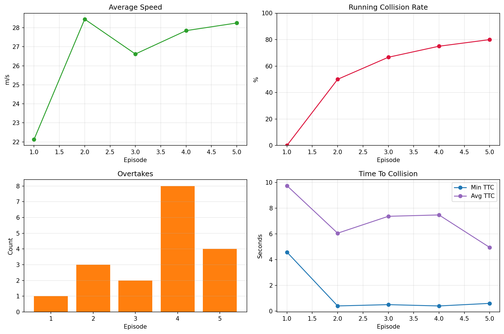

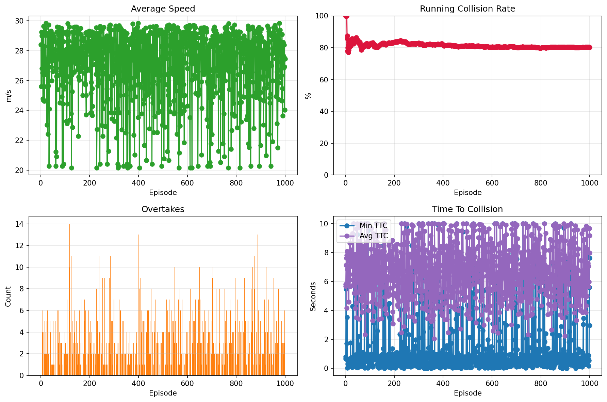

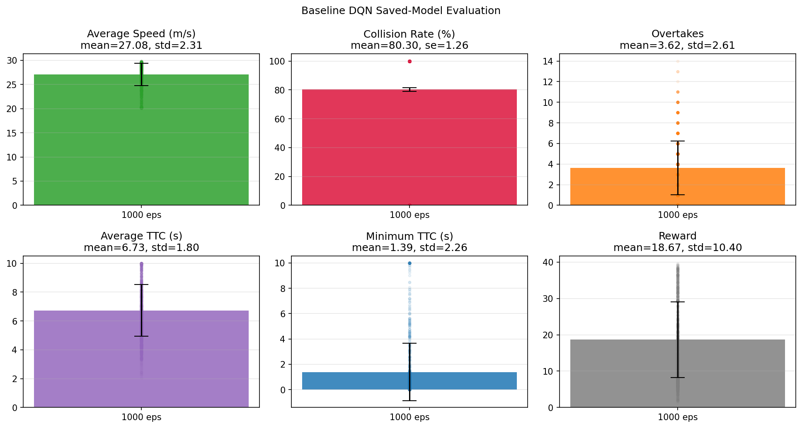

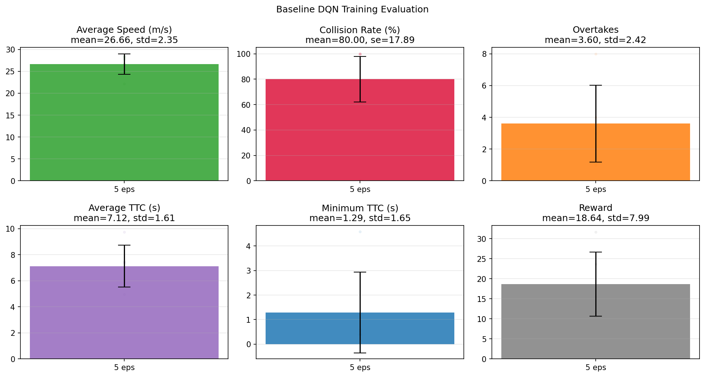

### Attention DQN potential-field study

Source notebook: [`congested_reward_safety_factor_study.ipynb`](../notebooks/congested_traffic/congested_reward_safety_factor_study.ipynb)

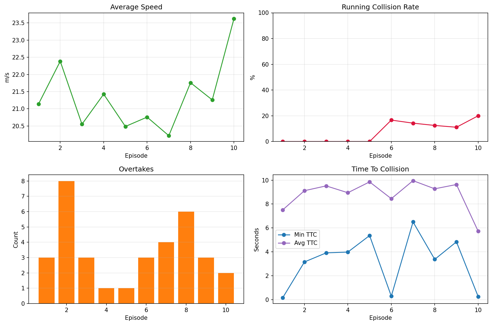

### Controlled congested-traffic study

Source notebook: [`congested_traffic_four_experiments.ipynb`](../notebooks/congested_traffic/congested_traffic_four_experiments.ipynb)

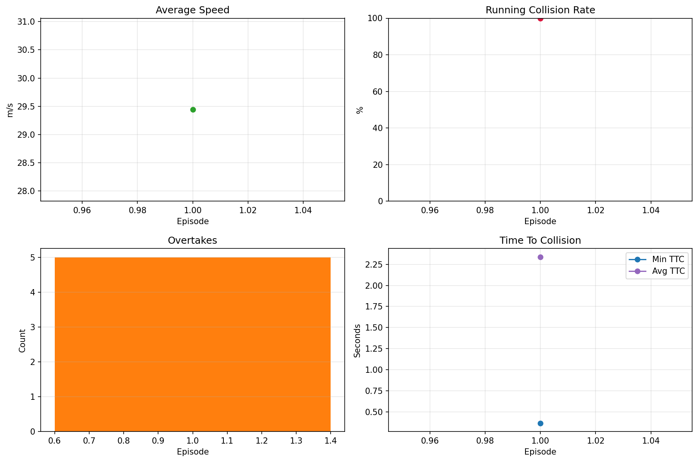

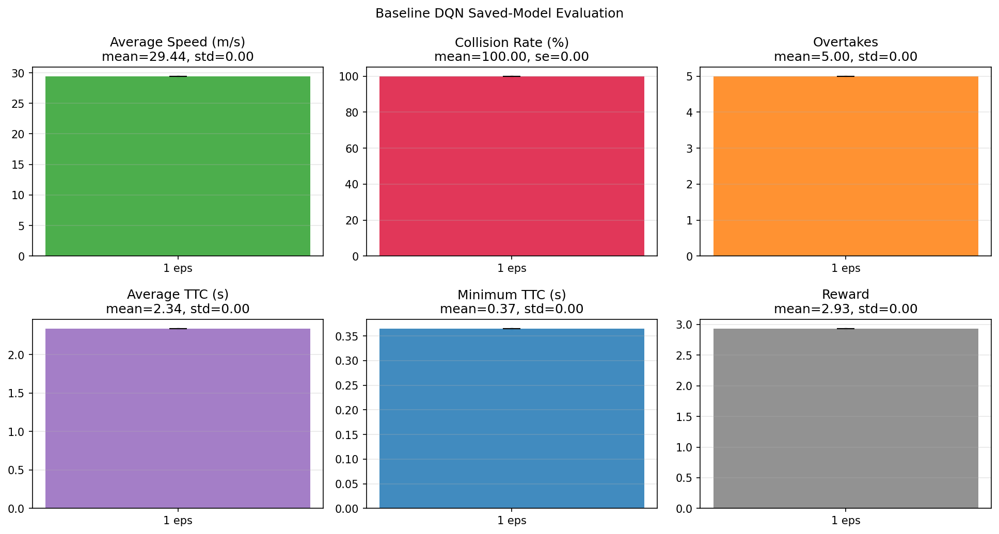

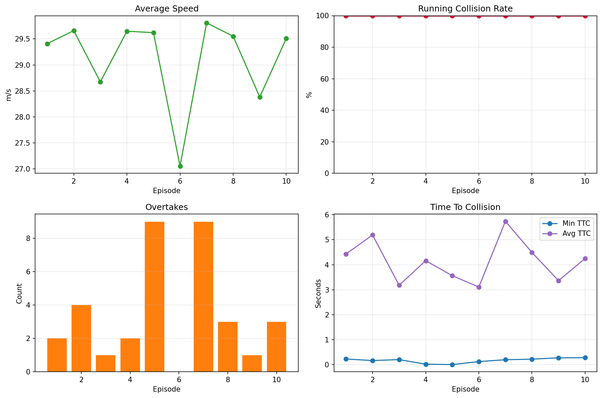

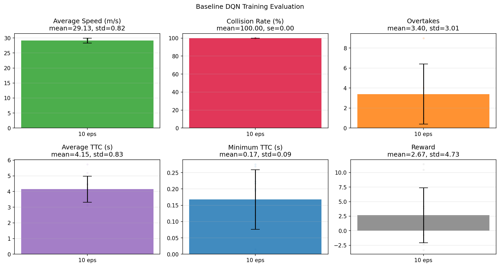

### Attention potential-field evaluation

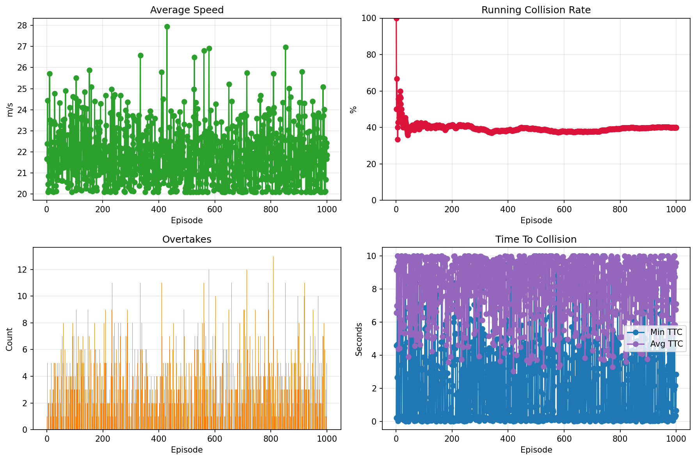

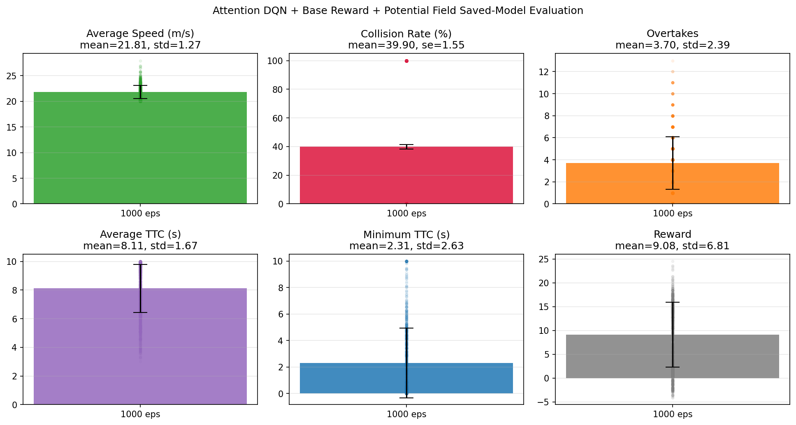

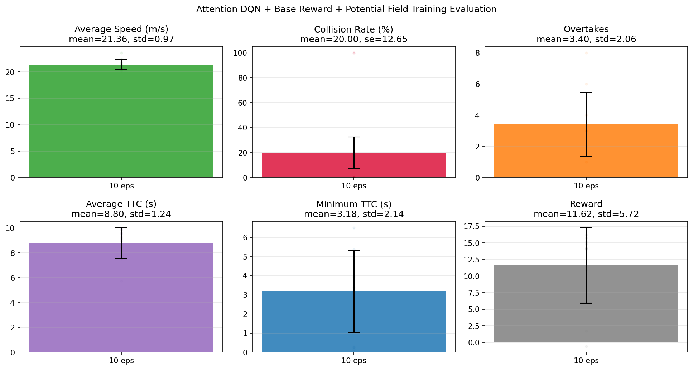

## Notebook visualization status

The retained DQN and PPO notebook files are output-stripped, so their plots
are generated when the notebooks run rather than embedded in the notebooks.
The planning notebook currently contains text output and an environment error,
but no saved graph. The 13 PNGs above are the complete curated set of
rendered structured result visuals available in this checkout.

When adding a new experiment, store its rendered figures beside a compact
configuration/result manifest, link every figure from this page, and record
the source notebook, seed, evaluation protocol, and artifact revision.
